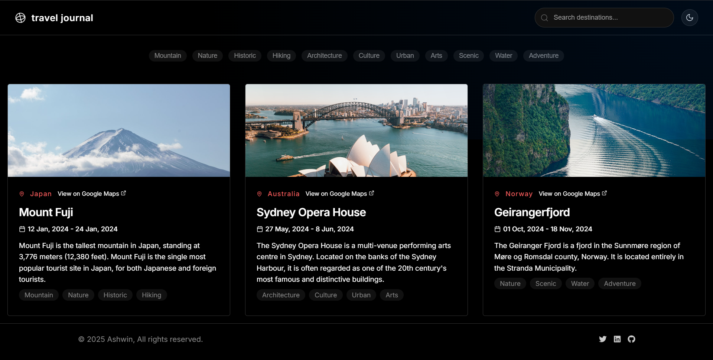
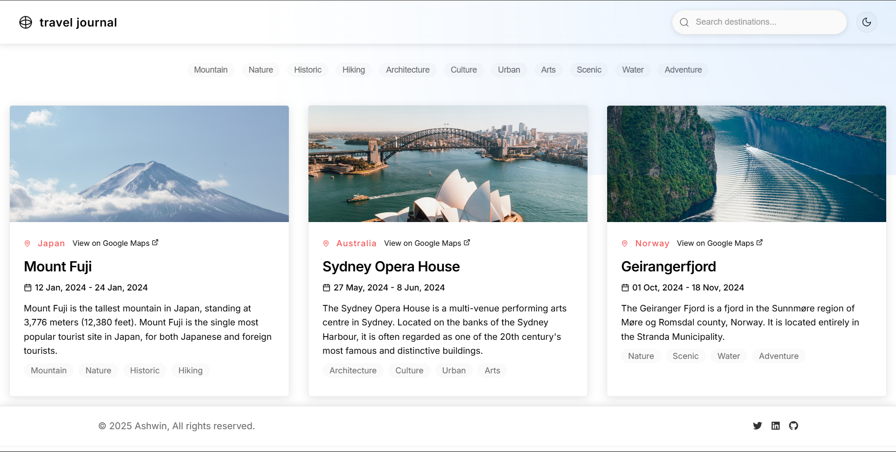
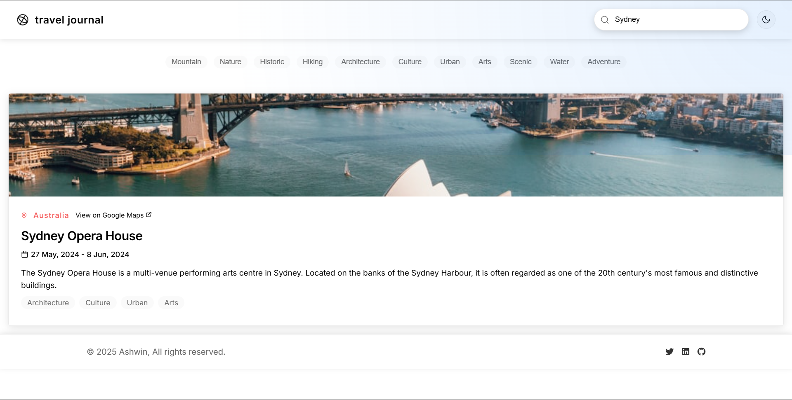
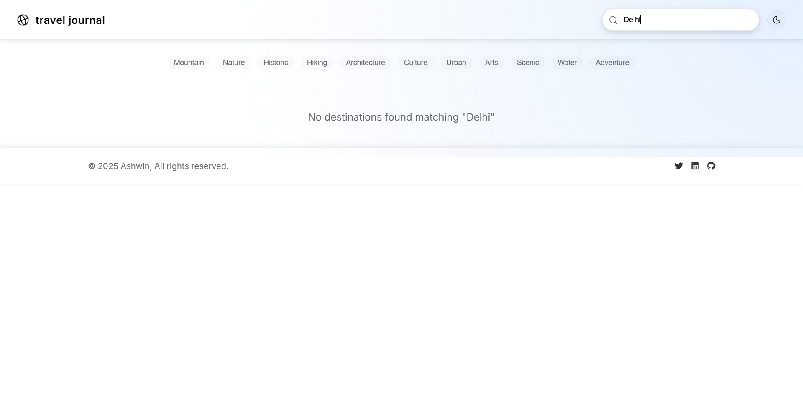
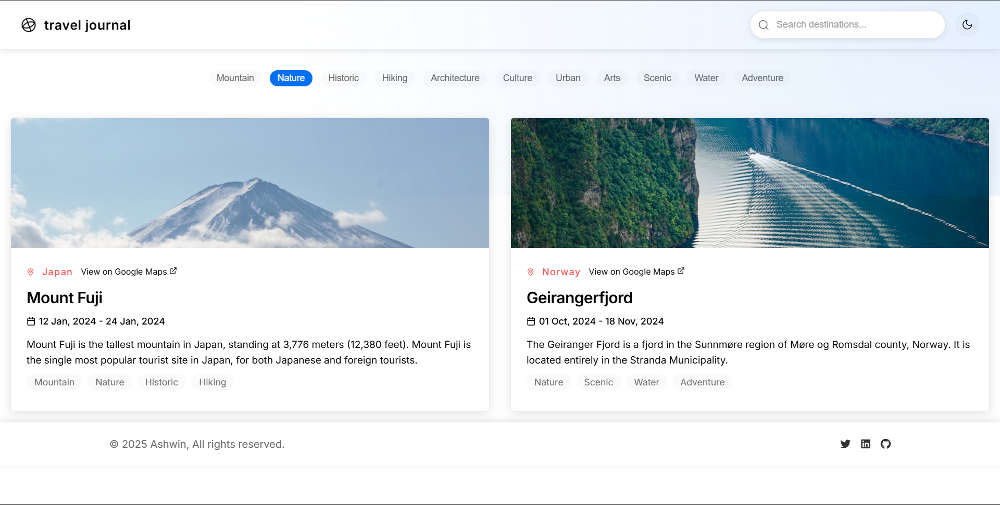

# Travel Journal

<div align="center">


A digital travel companion that helps you document your adventures with rich details, photos, and precise locations using Google Maps location details.

[Features](#-features) • [Tech Stack](#-tech-stack) • [Installation](#-installation) • [Contributing](#-contributing) • [Screenshots](#-screenshots) • [Live](#-live) • [Author](#-author)

</div>

## Features

- **Location Mapping** - Integrate precise Google Maps locations for each destination
- **Detailed Documentation** - Record comprehensive information about your travels
- **Photo Integration** - Upload and showcase your travel photography
- **Intuitive Interface** - User-friendly design for effortless journey logging and with dark/light mode
- **Responsive Layout** - Access your travel memories on any device
- **Geographic Precision** - Mark exact locations of your adventures
- **Search and Filter** - Search and filter the locations accordingly

## Tech Stack

### Frontend Development
- **[React](https://reactjs.org/)** - Dynamic user interface development
- **[Vite](https://vitejs.dev/)** - Next-generation frontend tooling
- **HTML5** - Semantic structure and content organization
- **CSS3** - Responsive styling and animations
- **JavaScript** - Interactive functionality and data management

### Key Features
- Responsive design implementation
- Interactive map integration
- Dynamic content management
- Smooth transitions and animations
- Dark and light mode themes
- Tags and search for filtering

## Installation

1. **Clone the repository**

   ```bash
   git clone https://github.com/your-username/travel-journal.git
   cd travel-journal
   ```

2. **Install dependencies**

   ```bash
   npm install
   ```

3. **Start the development server**

   ```bash
   npm start
   ```
   **The application will be available at `http://localhost:5173`.**

## Contributing

We welcome contributions to make Travel Journal even better! Here's how:

1. Fork the repository
2. Create a feature branch:

   ```bash
   git checkout -b feature/your-feature-name
   ```
3. Make your changes and commit them:

   ```bash
   git commit -m 'Add some feature'
   ```
4. Push to the branch:

   ```bash
   git push origin feature/your-feature-name
   ```
5. Open a Pull Request

## Screenshots

<div align="center">

### Travel Journal Interface


## Light Mode


## Search Results





## Selecting Tags



</div>

## Live

<div align="center">

[](https://travel-journal-react-omega.vercel.app/)

</div>

---

<div align="center">
Made with ❤️ by Ashwin S Nambiar
</div>
